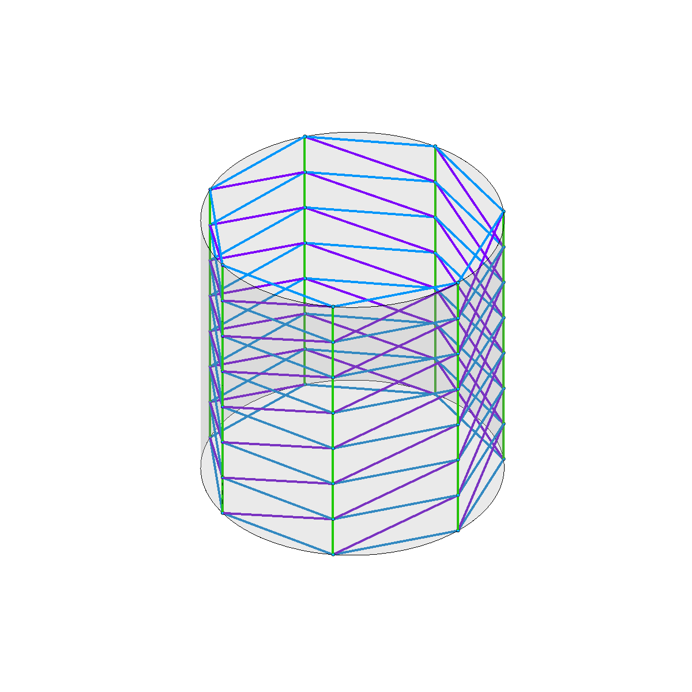
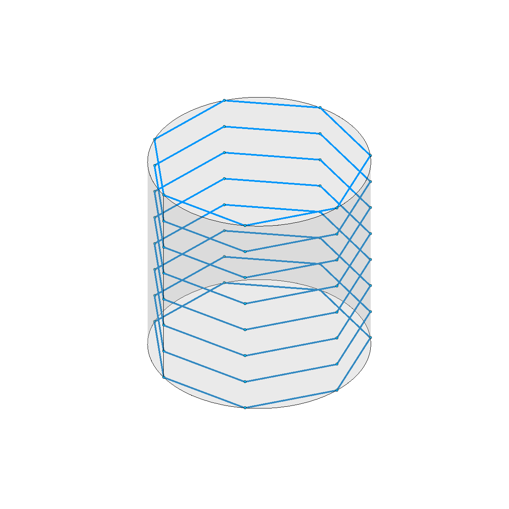
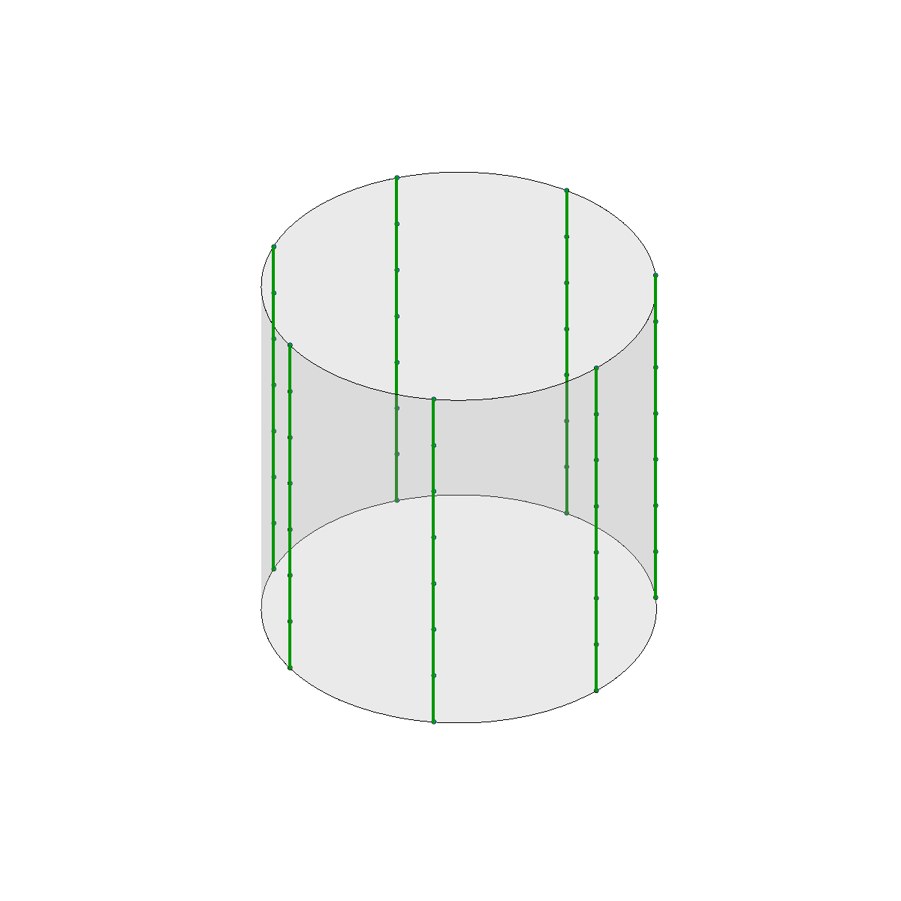
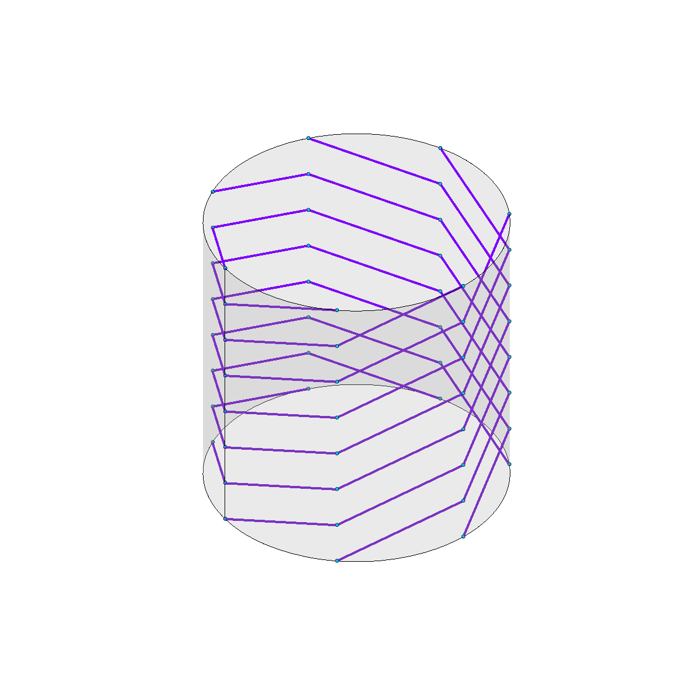

## Christmas Exercises Intro

## Index

- [Exercise 1 - Connecting Points around a cylinder](#exercise-1---connecting-points-around-a-cylinder)
- [Exercise 2 - Three dimensional lists](#exercise-2---three-dimensional-lists)
- [Exercise 3 - Koch Snowflake](#exercise-3---koch-snowflake)
- [Exercise 4 - Toyo Itto Tower OPTIONAL](#exercise-4---toyo-itto-tower-optional)
- [Exercise 5 - Toyo Itto Shell OPTIONAL](#exercise-5---toyo-itto-shell-optional)

# Exercise 1 - Connecting Points around a cylinder



Given a 2-dimensional grid of points on the surface of a cylinder.

1. For each point, create a line that connects it to the point on it's right (Only if the point on the right exists)
   
2. For each point, create a line that connects it to the point above it (only if the point exists)
   
3. For each point, create a line that connects it to the point diagonally above and to the right.
   

Each step must have it's own output. You will find the expected result's internalized in the grasshopper file.

# Exercise 2 - Three dimensional lists


In this exercise, you start with a script that already contains a triple loop:

```python
# Create a nested list of boxes
# 3 Dimensions means a triple loop!
bBoxes = []
for i in range(len(pointCubeList)-1):
    bBoxGrid = []
    for j in range(len(pointCubeList[i])-1):
        bBoxRow = []
        for k in range(len(pointCubeList[i][j])-1):
            # Check the output of this
            print("Coords: " + str(i) + "," + str(j) + "," + str(k))
            pt = pointCubeList[i][j][k]
            ptDiag = pointCubeList[i+1][j+1][k+1]
            bbox = RG.BoundingBox(pt,ptDiag)
            # Append the box the row
            bBoxRow.append(bbox)
        # Append the list of boxes to the grid
        bBoxGrid.append(bBoxRow)
    # Append the grid of boxes to the result list
    bBoxes.append(bBoxGrid)

# Convert nested list into grasshopper tree
a = th.list_to_tree(bBoxes)
```

This loop creates a _3-dimensional_ list structure contaning `RG.BoundingBox` (just like a cube). In order to access any of the boxes, you will need to provide 3 indexes. For example, to access the first bounding box, you can do `box = bBoxes[0][0][0]`.

> You can read more about the bounding box class [here](https://developer.rhino3d.com/api/RhinoCommon/html/T_Rhino_Geometry_BoundingBox.htm)

## Step 1. Find the centers

Given this 3-dimensional list of bounding boxes, create a similar list structure that will contain only the centers of each bounding box.


## Step 2. Connect the centers

1. Connect each center with all it's adjacent boxes (boxes that share a side
2. Connect each center to the one diagonally above (`[+1][+1][+1]`)


# Exercise 3 - Koch Snowflake


We already covered this one in class, but if you need a recap you can watch [this video](https://www.khanacademy.org/math/geometry-home/geometry-volume-surface-area/koch-snowflake/v/koch-snowflake-fractal).

## Objective:

Create a script that will make a _Koch Snowflake_ that will run for **at least** 5 iterations.

# Exercise 4 - Toyo Itto Tower _OPTIONAL_

In this exercise, you must create a tower inspired by Toyo Itto's Fira Tower in Barcelona.


## Code explanation:

The `createContour()` function you will find inside the script will help you create the outline curve for each floor. The function has 3 inputs:

1. A plane to generate the curve at.
2. A radius controlling the size of the curve.
3. An offset controlling it's deformation.

```python
def createContour(plane,radius,offset):
    points = []
    numPoints = 9 # Num of ponts to calculate
    offsetEach = 3 # Separation between offset points.

    for i in range(numPoints):
        thisRadius = radius
        if(i % offsetEach == 0):
            thisRadius += offset
        # Circular coordinates
        x = thisRadius * math.cos(i*2*math.pi/numPoints)
        y = thisRadius * math.sin(i*2*math.pi/numPoints)
        # Compute point around plane
        pt = plane.PointAt(x,y,0)
        # Add to list
        points.append(pt)

    # Repeat the first point to close the curve
    points.append(points[0])

    # Create a CLOSED interpolated curve
    curve = RG.Curve.CreateInterpolatedCurve(points,3,RG.CurveKnotStyle.ChordPeriodic)
    return curve
```

It basically works by generating 9 points around a circle, and offsetting some of them by a specified ammount. Then we create a closed curve using the points.

> We have not covered _python functions_ yet, but dont worry. You don't need to change anything inside it.
> You can use it as any other function:
>
> ```python
> curve = createContour(aPlane,4,1)
> ```

## Steps:

1. Starting at the input reference plane (`refPlane`), create the initial floor planes for each floor.
2. Create the contour at each floor plane. Each floor must have changing values of:
   1. Offset
   2. X and Y position of the plane
   3. Rotation per plane
3. Loft all of the curves into a smooth surface. (Tip: The loft function lives in the _BREP_ class, search for it in the [RhinoSDK](https://developer.rhino3d.com/api/RhinoCommon/html/R_Project_RhinoCommon.htm))

# Exercise 5 - Toyo Itto Shell _OPTIONAL_

## Code explanation:

In this exercise, you fill find another function at the beguinning of the document: `gaussDistribution(x)`. If you input a number from 0.0 to 1.0, it will return a modified number between 0.0 and 1.0. The formula was taken directly from the [gaussian function](https://en.wikipedia.org/wiki/Gaussian_function) wikipedia page:

```python
def gaussDistribution(x):
    nu = 0.5
    rho2 = 0.2
    rho = math.sqrt(rho2)
    op1 = 1 / (rho * math.sqrt(2*math.pi))
    power = -0.5*math.pow((x-nu)/rho,2)
    op2 = math.pow(math.e,power)
    gauss = op1 * op2
    return gauss
```

You can use this function if you want to modify the radius of your polygons. If you feel more comfortable changing the radius in any other way, that is fine too.

You will also find a small loop that will print the input and output value to the `out` so you can see how it works.

```python
# Testing gauss distribution (check output)
for i in range(11):
    num = i/10
    t = gaussDistribution(num)
    print("Input value: " + str(num))
    print("Gauss value: " + str(t))
```

> Whenever you are not sure about what something does, remember to `print`, or to send the result to an output to visualize it.

## Step 1 - Create the main axis


## Step 2 - Create Perpendicular Frames

> Try to introduce a small rotation on each plane so that the structure has the specified ammount of `turns`.

There is a handy function for this, `curve.PerpendicularFrameAt(t)`, but be careful as it returns a _tupple_ `(bool,Plane)`. The first item is a boolean specifying if the operation was successful. The second item will be the resulting plane.


## Step 3 - Create Polygons

I suggest using circular coordinates to generate the points, and then generate a polyline with them.

In the original grasshopper exercise, the polygons were moved up to be laying on the XY Plane. This step is optional.


## Step 4 - Create main beams

Create a curve that passes through the first point of each polygon. Do the same for the rest.


## Step 5 - Create secondary beams

Create lines as secondary curves, starting with t=0 on the first curve with t=0 of the second, t=0.


