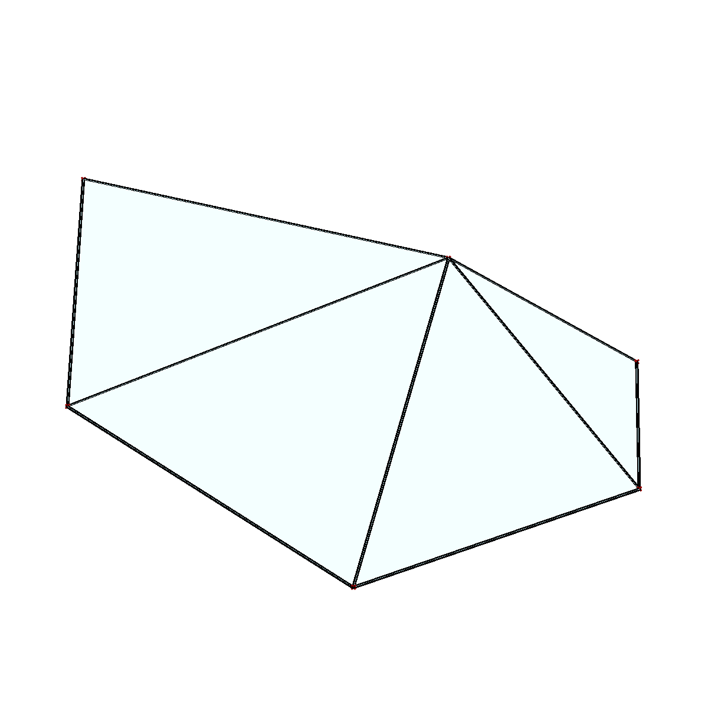
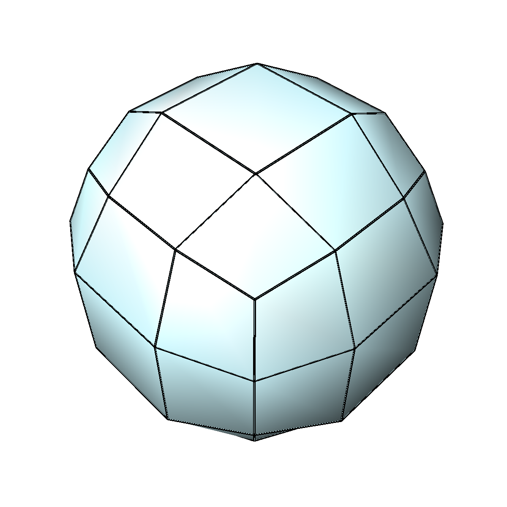
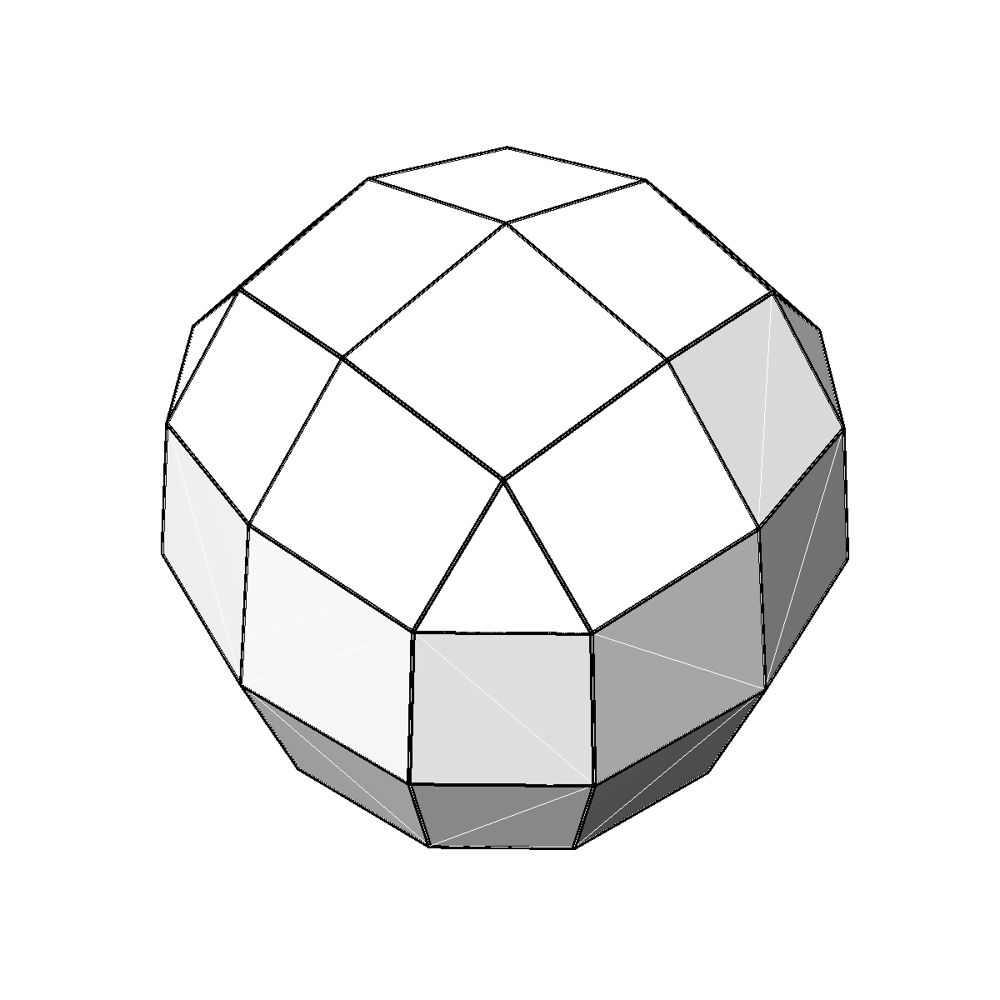

## Final Exercise

You can find the previous class file (about functions) [HERE](https://drive.google.com/file/d/1HMUQeh4eQkgMui2GqWc_d-0sG9lg-gtY/view?usp=sharing)

You can find the grasshopper file for the exercises [HERE](https://drive.google.com/open?id=1-HjKOpI9gnEjxnKC_e0Sw8iqvFAJRGEO)

Remember you have some python cheatsheets containing most of the usefull stuff [HERE](https://drive.google.com/file/d/1kIzAA1Ln2IqHT0VENobCnyE7-ikAMjEO/view)

### Delivery

You should deliver the exercises by the end of the semester - _**17 February 2020**_

Please deliver your assignments [HERE](https://drive.google.com/drive/folders/15YDnDN75bl3CAz4Slo5hx7I_1YmA0aZf?usp=sharing) with filename `FinalExercise-STUDENTNAME.gh`

## Index

- [Things to keep in mind:](#things-to-keep-in-mind)
- [Part 1 - Create a function that takes a list of points and _returns_ a mesh.](#part-1---create-a-function-that-takes-a-list-of-points-and-returns-a-mesh)
- [Part 2 - Create the DualGraph of a mesh](#part-2---create-the-dualgraph-of-a-mesh)
- [Part 3 - Use the function in _Part 1_ in _Part 2_](#part-3---use-the-function-in-part-1-in-part-2)

# Things to keep in mind:

## GH File

If you download the linked `.gh` file above, you will find the python component already created for you. You can create a new one if you find it easier initially.

Inside the component you will find a function that, given a list of points, will return those points ordered. It is a simple script I found on the [Rhino forum](https://discourse.mcneel.com/t/shortest-polyline-between-points/73235/12) written by Anders Deleurean ;)

This function will be key to solving correctly part 2.

Feel free to write in the Telegram channel if you have any doubts!

## Creating functions

> Remember to create a function you must use the `def` keyword, followed by the name of the function, and parenthesis containing the function input names. For example:
>
> ```python
> def myFunctionName(input1,input2):
>     print input1
>     print input2
> ```
>
> You can then use your function by using it's name, and providing the input data between the parenthesis:
>
> ```python
> myFunctionName("This will be 'input1'","This will be 'input2'")
> ```
>
> This will execute the code inside the function.

## Closed polylines in RhinoPython

In python, in order to create a closed polyline from a list of points, you must repeat the first point at the end of the list (first and last point of the list should be the same)

## Create mesh from closed polyline

Inspect the different functions inside `RG.Mesh`. All of the mesh creation methods start with `Create...`, and you will find one specifically usefull for this exercise!

# Part 1 - Create a function that takes a list of points and _returns_ a mesh.



In order to be able to test this, create an input in your script called **inputPoints**, set it to _list access_ and set it's type hint to `Point3d`. The points you input here should be **ordered**

1. Create a new function in your script called `pointsToMesh()`.
2. This new function must have an input that will be list of points, you can call it whatever you want (but `pointList` or `points` would be fine).
3. Inside the function (remember, indentation!):
   1. Use the input list to create a **closed polyline**.
   2. Use the specific creation function inside `RG.Mesh` to obtain a mesh using the previous polyline
   3. `return` the mesh you just created.
4. Now that the function has been created, you can use it with the **inputPoints** input of your script.
5. Output the result to an output node called `resultMesh`.

# Part 2 - Create the DualGraph of a mesh

:::columns
::::column

::::

::::column

::::
:::

Add a new input to your python script node, call it `inputMesh` and set it's type hint to `Mesh`.

1. Inside your script, create an empty list called `cells`.
2. For each vertex of the mesh:
   1. Find the list of adjacent faces. The returned list will be a list of indexes in the `mesh.Faces` list.
   2. Create an empty list called `centers`
   3. Loop through the list of indexes:
      1. Get the corresponding face
      2. Get the center of that face
      3. Add the center to the center list
   4. Use the list of centers to create a **closed polyline**.
      1. You may need to sort the list of centers using the function provided.
   5. Add the polyline to the `cells` list.

Assign the cells list to an output called `dual`

# Part 3 - Use the function in _Part 1_ in _Part 2_

Modify your script in part 2, using the function created in _Part 1_ to obtain a list of meshes for every polyline inside the `cells` list.

Assign the result to an output called `dualMeshes`.
