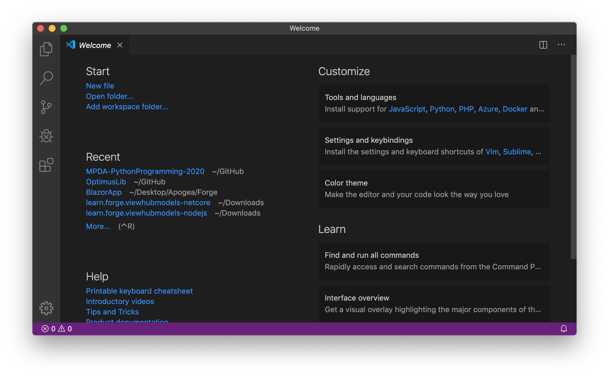
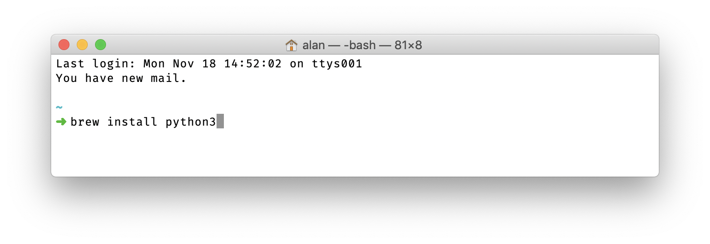
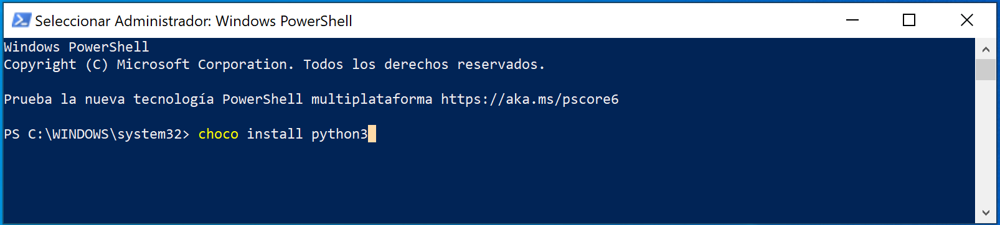
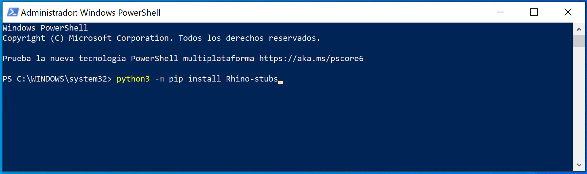
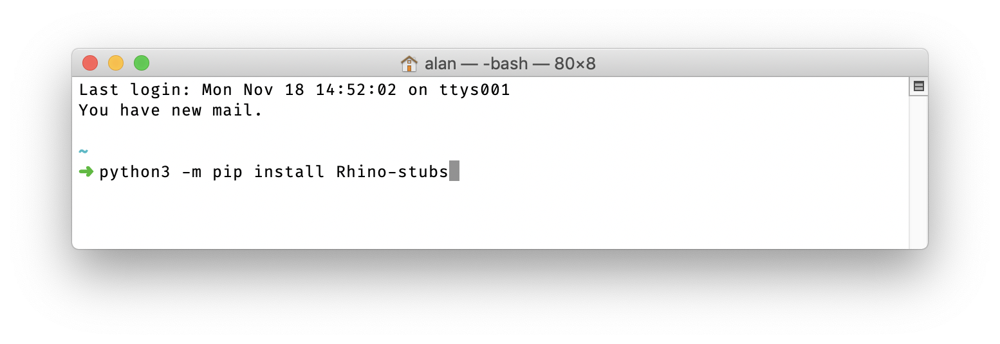

# Install

In order to follow this tutorial, you download and install the following programs

- VSCode
- Rhinoceros 6 with Grasshopper
- Python 3.x (latest version)
- Rhino-stubs

## VSCode

Download and install [VSCode](https://code.visualstudio.com), this will be our text editor of choice.



## Choco / Brew

Choco(Windows)/Brew(Mac) are install managers that will take care of most of the trouble when installing python and other programs.

A very nice guide to install `brew`(mac) can be found [here](http://osxdaily.com/2018/03/07/how-install-homebrew-mac-os/).

To install choco on windows, follow this [install guide](https://jcutrer.com/windows/install-chocolatey-choco-windows10).

> If you are unsure of what to do, or how to do it, please contact **_Alan Rynne_** on Telegram.

## Python

Once choco / brew has been installed. We can easily install python on a Mac by running:

```shell
brew install python3
```

or in Windows,

```shell
choco install python3
```





## Rhino-stubs

We also need to install RhinoStubs. They come as a Python package you can install with `pip`, the Python package manager.

Either on mac or windows, run this command on your terminal:

```shell
python3 -m pip install Rhino-stubs
```





Once the process has finished, you are all set to write your own Python scripts for Grasshopper using VSCode.

# Setup

> To be continued in class...
